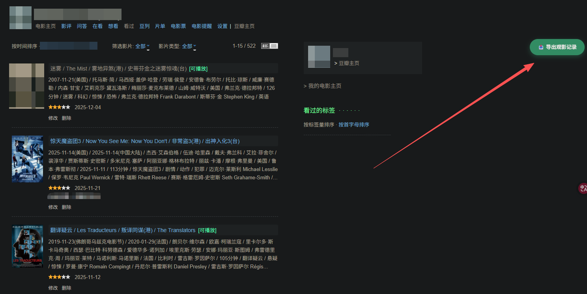
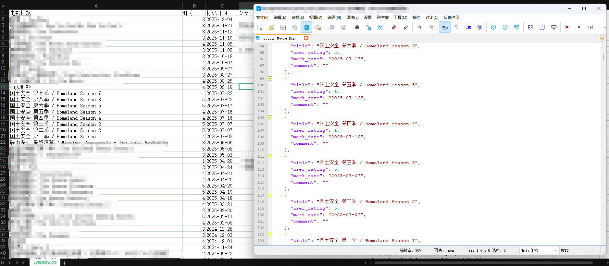

# 豆瓣电影数据导出工具 (Douban Movie Export Tool)

  

一个强大的油猴 (Tampermonkey) 脚本，用于将你的豆瓣“看过”电影列表导出为 **Excel (.xlsx)** 或 **JSON** 文件。

## ✨ 核心特性

- **📊 Excel 完美导出**：
  - 内置 SheetJS 引擎，生成原生 `.xlsx` 文件。
  - **自动调整列宽**：彻底告别 CSV 乱码和 `######` 显示问题。
  - **数据全**：包含标题、评分、标记日期、标签 (Tags)、短评和豆瓣链接。
- **🤖 JSON 格式导出**：
  - 生成结构化数据，包含完整元数据。
  - **AI 分析专用**：专为投喂 ChatGPT / Claude / DeepSeek 等 AI 进行观影喜好分析设计。
- **⚡️ 智能抓取**：
  - **自动适配**：自动从海报模式切换到列表模式以获取标签 (Tags) 等完整数据。
  - **安全防封**：内置随机延迟机制 (1.5s - 3.5s)。
  - **断点续传**：支持中途刷新，脚本会自动识别进度并继续抓取。

## 🚀 快速安装

1. **安装管理器**：确保你的浏览器已安装 [Tampermonkey (油猴)](https://www.tampermonkey.net/) 扩展。
2. **一键安装**：点击下面的链接直接安装脚本：
   👉 **[点击安装 Douban Movie Export](https://github.com/byJming/douban-movie-exporter/raw/main/douban-movie-exporter.user.js)**

   *(安装时如弹出 Tampermonkey 界面，点击“安装”或“更新”即可)*

## 📖 使用指南

### 1. 进入页面
登录豆瓣电脑版，点击右上角头像进入个人主页。
找到 **“我看”** 栏目，点击 **“看过”** 链接。

### 2. 启动导出
进入页面后，右上角会出现绿色的 **“📤 导出观影记录”** 悬浮按钮。
点击它，勾选你想要保存的字段（如标签、短评等），然后点击“开始抓取”。

### 3. 获取结果
抓取完成后，脚本会暂停并弹出下载面板。你可以选择：
- **Excel (.xlsx)**：排版整齐，自带列宽，适合人类阅读和整理。
- **JSON**：结构化数据，适合开发者或发送给 AI 进行分析。

## 🛠️ 技术栈

- **Runtime**: Tampermonkey / JavaScript (ES6)
- **Library**: [SheetJS (xlsx)](https://sheetjs.com/) - 用于前端生成 Excel 文件
- **UI**: 原生 DOM 操作 + CSS3 动画

## ⚠️ 免责声明

本脚本仅供个人学习和备份数据使用。
- 数据的所有权归豆瓣及用户所有。
- 请勿使用本工具进行高频恶意爬取。

## 📄 开源协议

MIT License
